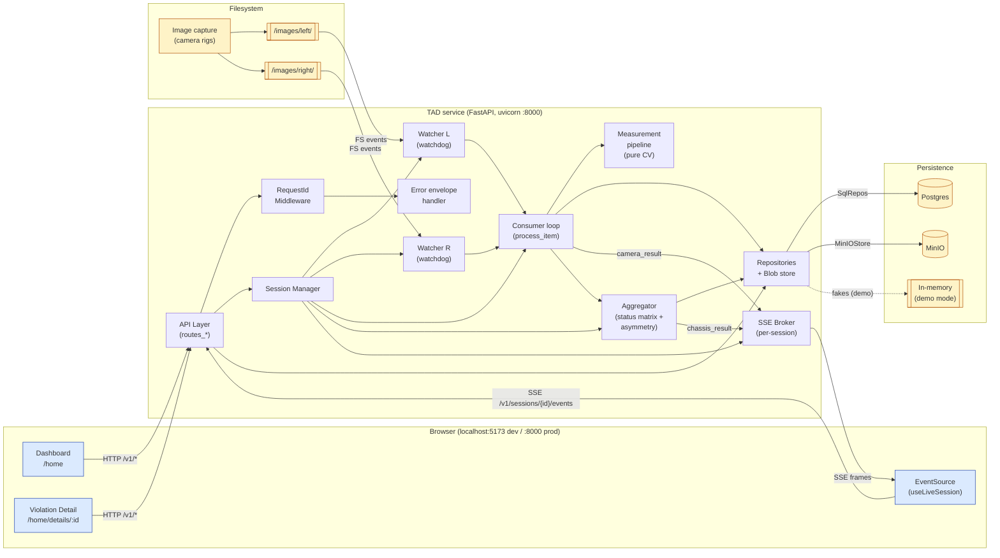
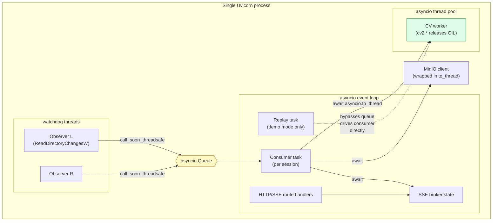
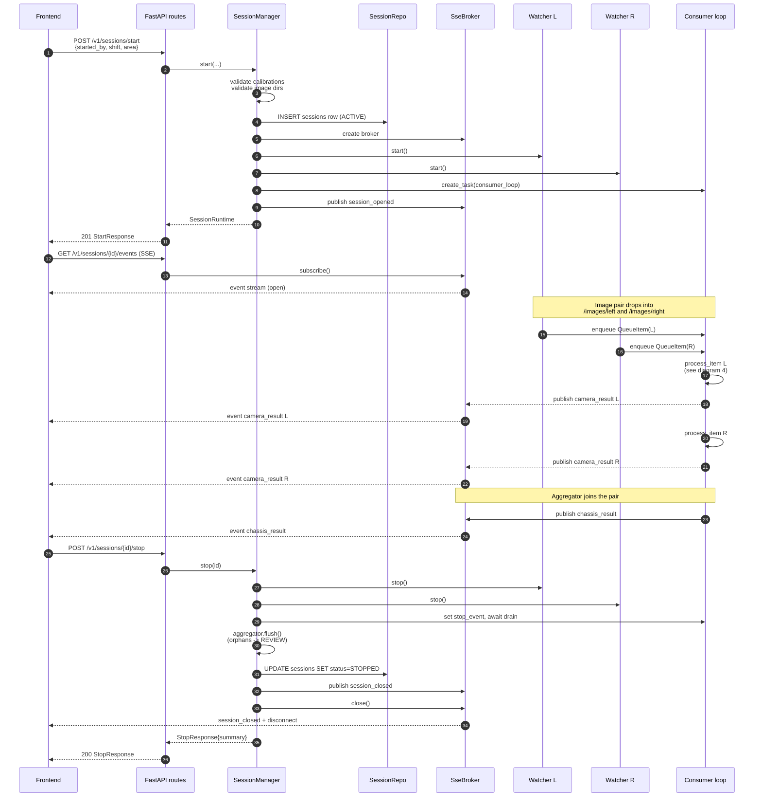
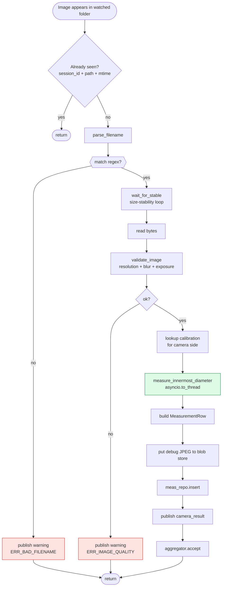
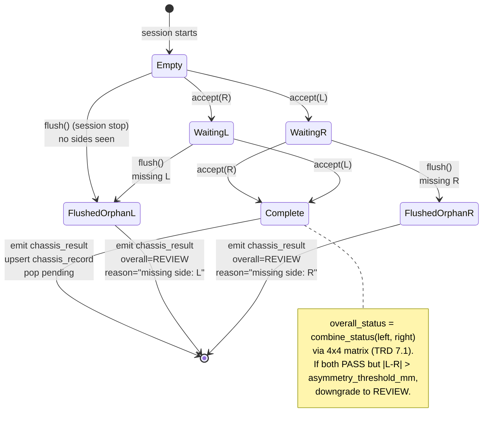
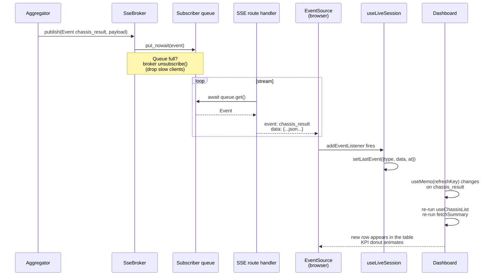
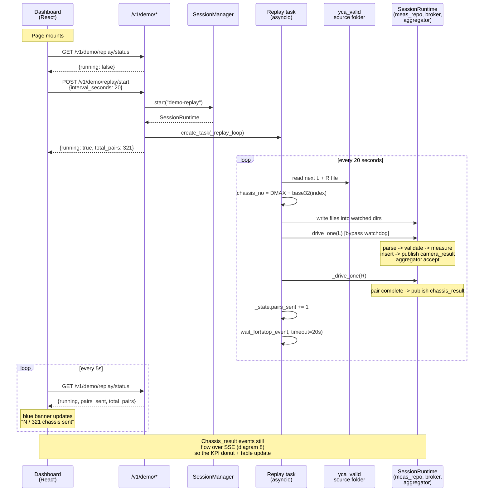
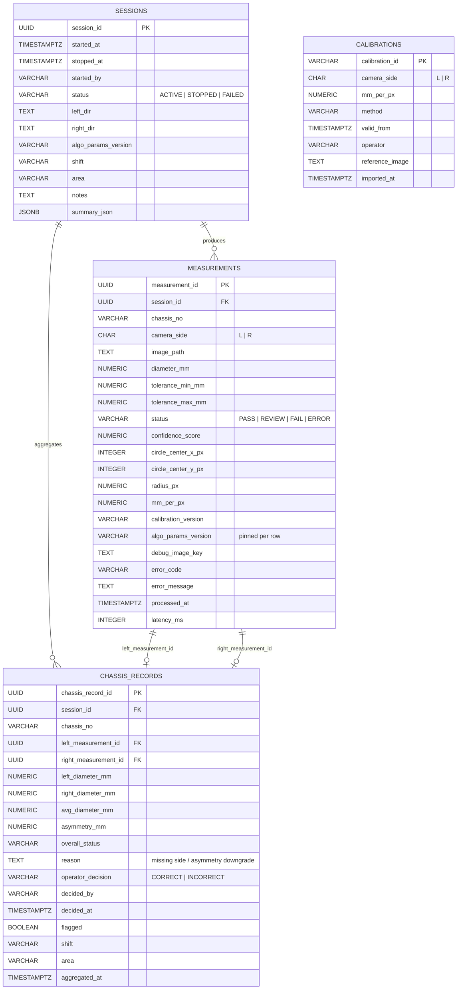
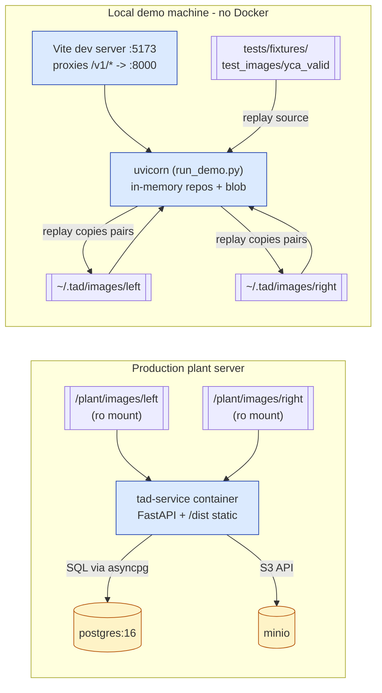

# Architecture Flow Diagrams

Detailed flow diagrams for the Trailing Arm Detection system, covering
both production wiring and the demo-mode infrastructure used for local
end-to-end testing.

Diagrams are written in [Mermaid](https://mermaid.js.org/) so they render
directly on GitHub, VS Code (with the Markdown Preview Mermaid Support
extension), or any modern Markdown viewer.

## Contents

1. [High-level system architecture](#1-high-level-system-architecture)
2. [Runtime processes and threads](#2-runtime-processes-and-threads)
3. [Session lifecycle (start -> stop)](#3-session-lifecycle)
4. [Per-image processing pipeline](#4-per-image-processing-pipeline)
5. [Measurement pipeline (classical CV)](#5-measurement-pipeline-classical-cv)
6. [Status classification decision tree](#6-status-classification-decision-tree)
7. [Chassis aggregation (dual-camera)](#7-chassis-aggregation)
8. [Real-time update path (SSE)](#8-real-time-update-path-sse)
9. [Demo-mode replay flow](#9-demo-mode-replay-flow)
10. [Frontend component tree](#10-frontend-component-tree)
11. [Data model (ER diagram)](#11-data-model-er-diagram)
12. [Deployment topology](#12-deployment-topology)

---

## 1. High-level system architecture

Shows every component and how they talk to each other. The three
coloured groups map to: **the browser**, **the backend service**, and
**persistence + filesystem**.



---

## 2. Runtime processes and threads

Where the work actually executes. Uvicorn is single-worker on purpose —
session state is in-memory and mustn't be sharded (see CLAUDE.md
"Never" list).



---

## 3. Session lifecycle

End-to-end sequence for starting a session, processing an image pair,
and stopping.



---

## 4. Per-image processing pipeline

`process_item` in [`src/tad/sessions/consumer.py`](../src/tad/sessions/consumer.py).



---

## 5. Measurement pipeline (classical CV)

`measure_innermost_diameter` in
[`src/tad/measurement/pipeline.py`](../src/tad/measurement/pipeline.py).
Algorithm version **`algo-1.3.0`** — see
[ADR-008](decisions/ADR-008.md) for the switch from Canny + RANSAC.

```mermaid
flowchart LR
    subgraph "Preprocessing"
        BGR([BGR image])
        GRAY[cvtColor -> gray]
        BLUR[GaussianBlur<br/>kernel=5]
    end

    subgraph "Isolation"
        TH[adaptiveThreshold<br/>GAUSSIAN_C, BINARY_INV<br/>block=51, c=10]
        MORPH[morph close<br/>3x3 kernel]
        CONT[findContours<br/>RETR_EXTERNAL]
        SORT[sort by area<br/>largest first]
        FILT[drop contours<br/>area &lt; 50]
    end

    subgraph "Detection (per contour)"
        MASK[mask grayscale<br/>by contour]
        HOUGH[HoughCircles<br/>minR = (target-tol)/2 * ppm<br/>maxR = (target+tol)/2 * ppm<br/>param2=20]
        FIRST{circle found?}
    end

    subgraph "Output"
        DIAM[diameter_mm<br/>= 2 * r_px * mm_per_px]
        EVAL[evaluate_status<br/>see diagram 6]
        CONF[compute_confidence<br/>linear in delta]
        ANNOT[render_debug_image]
        OUT([PipelineOutput])
    end

    ERR([ERR_NO_CIRCLE])

    BGR --> GRAY --> BLUR
    BLUR --> TH
    TH --> MORPH --> CONT --> SORT --> FILT
    FILT --> MASK
    MASK --> HOUGH --> FIRST
    FIRST -- no, try next contour --> MASK
    FIRST -- no contours left --> ERR
    FIRST -- yes --> DIAM
    DIAM --> EVAL
    DIAM --> CONF
    EVAL --> ANNOT
    CONF --> ANNOT
    ANNOT --> OUT

    style HOUGH fill:#ddd6fe,stroke:#5b21b6
    style ERR fill:#fee2e2,stroke:#dc2626
```

---

## 6. Status classification decision tree

`evaluate_status` in
[`src/tad/measurement/confidence.py`](../src/tad/measurement/confidence.py).

Band widths are configurable per `algo_params`. The current demo
configuration is shown in parentheses.

```mermaid
flowchart TD
    START([measured diameter_mm])
    IN_WINDOW{d in<br/>tolerance_min..max?<br/>(15..25 mm)}
    DELTA[delta = |d - target|<br/>(target = 20 mm)]
    D_OK{delta &lt;= ok_band?<br/>(1.0 mm)}
    D_SOK{delta &lt;= somewhat_ok?<br/>(1.5 mm)}

    PASS([PASS<br/>Okay<br/>green])
    REV([REVIEW<br/>Somewhat Okay<br/>amber])
    FAIL([FAIL<br/>Not Okay<br/>red])
    ERR([ERROR<br/>from pipeline<br/>grey])

    NO_CIRCLE([no circle<br/>detected])

    START --> HAS_CIRCLE{circle found?}
    HAS_CIRCLE -- no --> NO_CIRCLE --> ERR
    HAS_CIRCLE -- yes --> IN_WINDOW
    IN_WINDOW -- no --> FAIL
    IN_WINDOW -- yes --> DELTA --> D_OK
    D_OK -- yes --> PASS
    D_OK -- no --> D_SOK
    D_SOK -- yes --> REV
    D_SOK -- no --> FAIL

    style PASS fill:#dcfce7,stroke:#15803d,color:#14532d
    style REV fill:#fef3c7,stroke:#b45309,color:#713f12
    style FAIL fill:#fee2e2,stroke:#dc2626,color:#7f1d1d
    style ERR fill:#e5e7eb,stroke:#4b5563,color:#1f2937
```

---

## 7. Chassis aggregation

`Aggregator.accept` and the 4×4 status matrix in
[`src/tad/sessions/aggregator.py`](../src/tad/sessions/aggregator.py).

Per-camera results arrive in any order. When both sides of the same
chassis are present, emit a chassis_result and clear the pending entry.



Status matrix:

```
              RIGHT
           PASS   REVIEW   FAIL   ERROR
  L PASS   PASS   REVIEW   FAIL   ERROR
  E REVIEW REVIEW REVIEW   FAIL   ERROR
  F FAIL   FAIL   FAIL     FAIL   FAIL
  T ERROR  ERROR  ERROR    FAIL   ERROR
```

Plus the asymmetry rule: `PASS AND PASS with |L-R| > asymmetry_threshold_mm -> REVIEW`.

---

## 8. Real-time update path (SSE)

How a `chassis_result` event travels from the aggregator to the
Dashboard row that appears in the browser, with no page refresh.



---

## 9. Demo-mode replay flow

Local-host-only path that feeds chassis measurements from a fixture
folder on a timer. Entry point: the Dashboard mount in the browser.

See [`src/tad/api/routes_demo.py`](../src/tad/api/routes_demo.py) and
[`scripts/run_demo.py`](../scripts/run_demo.py).



### Why the replay bypasses the folder watcher

On Windows, `watchdog.observers.Observer` (which wraps
`ReadDirectoryChangesW`) has a fixed event buffer. Under fast writes
the buffer can overflow and events are silently dropped — we observed
this empirically on the demo rig. The replay task keeps the filesystem
side-effect (so the /images/left and /images/right folders look
identical to production) but drives the consumer pipeline directly via
`_drive_one(rt, side, path)`. This guarantees every pair reaches the
aggregator regardless of watcher state.

---

## 10. Frontend component tree

React 18 + Vite + Tailwind + Recharts + TanStack Table. Component
responsibilities mirror the TRD Section 10 page breakdown.

```mermaid
flowchart TB
    APP["App<br/>(BrowserRouter + routes)"]

    subgraph "Pages"
        DASH["Dashboard<br/>/home"]
        VD["ViolationDetail<br/>/home/details/:id"]
    end

    subgraph "Dashboard components"
        HDR["Header<br/>nav + live indicator"]
        DONUT["KpiDonut<br/>Recharts PieChart"]
        TREND["KpiTrend<br/>Recharts LineChart"]
        ALERT["AlertsList"]
        FILT["FiltersBar<br/>date / shift / condition / search"]
        TBL["ProductionTable<br/>TanStack Table"]
        PAG["Pagination"]
    end

    subgraph "Detail components"
        CAM_L["CameraCard (L)<br/>debug img + decision buttons"]
        CAM_R["CameraCard (R)"]
        DETAIL_PANEL["DetailPanel<br/>KV list + Flag + Download"]
    end

    subgraph "Shared"
        PILL["StatusPill<br/>label + colour + icon"]
        LABELS["labels.ts<br/>(TRD 10.3 mapping)"]
    end

    subgraph "Hooks"
        LIVE["useLiveSession<br/>active session + SSE"]
        LIST["useChassisList<br/>paged fetch + refresh"]
    end

    subgraph "API clients"
        CL["api/client.ts<br/>axios instance"]
        DASH_API["api/dashboard.ts"]
        CH_API["api/chassis.ts"]
        SESS_API["api/sessions.ts"]
        SSE_API["api/sse.ts<br/>EventSource wrapper"]
        DEMO_API["api/demo.ts<br/>replay endpoints"]
    end

    APP --> DASH
    APP --> VD

    DASH --> HDR
    DASH --> DONUT
    DASH --> TREND
    DASH --> ALERT
    DASH --> FILT
    DASH --> TBL
    DASH --> PAG
    DASH --> LIVE
    DASH --> LIST
    DASH --> DEMO_API

    VD --> HDR
    VD --> CAM_L
    VD --> CAM_R
    VD --> DETAIL_PANEL
    VD --> CH_API

    TBL --> PILL
    ALERT --> PILL
    CAM_L --> PILL
    CAM_R --> PILL
    DETAIL_PANEL --> PILL
    PILL --> LABELS

    LIVE --> SESS_API
    LIVE --> SSE_API
    LIST --> CH_API
    DASH --> DASH_API

    CL -.-> DASH_API
    CL -.-> CH_API
    CL -.-> SESS_API
    CL -.-> DEMO_API

    style PILL fill:#e0e7ff,stroke:#4338ca
    style LABELS fill:#e0e7ff,stroke:#4338ca
```



---

## 11. Data model (ER diagram)

Persistence schema from
[`src/tad/persistence/migrations/versions/001_initial_schema.py`](../src/tad/persistence/migrations/versions/001_initial_schema.py).



Notes:
- Every measurement row pins `algo_params_version` + `calibration_version` so historical records are reproducible even after a version bump (traceability requirement US-08).
- `chassis_records` has `UNIQUE(session_id, chassis_no)` so the aggregator's upsert is idempotent.
- Calibrations live in YAML as the source of truth; this table is an audit mirror.

---

## 12. Deployment topology

Production (with Docker) vs demo mode (without).



Key differences:

| | Production | Demo |
|---|---|---|
| Command | `make up && make migrate && make serve` | `make demo` |
| Repositories | `SqlSessionRepository`, `SqlMeasurementRepository`, `SqlChassisRepository` | `InMemorySessionRepository` etc. |
| Blob store | `MinIOStore` | `InMemoryBlobStore` |
| Session lifetime | Shift (hours) | Browser session; data lost on Ctrl-C |
| Folder watchers | Real capture system writes JPEGs | Replay task writes from `yca_valid/` |
| Auth | `AUTH_ENABLED=true` + mTLS (future) | Off |
| `algo_params` | `configs/algo_params/algo-1.3.0.yaml` (target 47.25 mm) | Runtime overlay in `scripts/run_demo.py` (target 20 mm, wider bands) |

---

## References

- [TRD](trd_doc.txt) — normative requirements
- [PRD](prd_doc.txt) — product/user-story view
- [architecture.txt](architecture.txt) — the prose build guide (pair this diagram doc with it)
- [demo_walkthrough.md](demo_walkthrough.md) — step-by-step local-host test plan
- [ADR-001](decisions/ADR-001.md) — classical CV only, no ML
- [ADR-008](decisions/ADR-008.md) — switch to contour + masked Hough (algo-1.3.0)
- [ADR-009](decisions/ADR-009.md) — demo-mode infrastructure (this doc's diagram 9)
